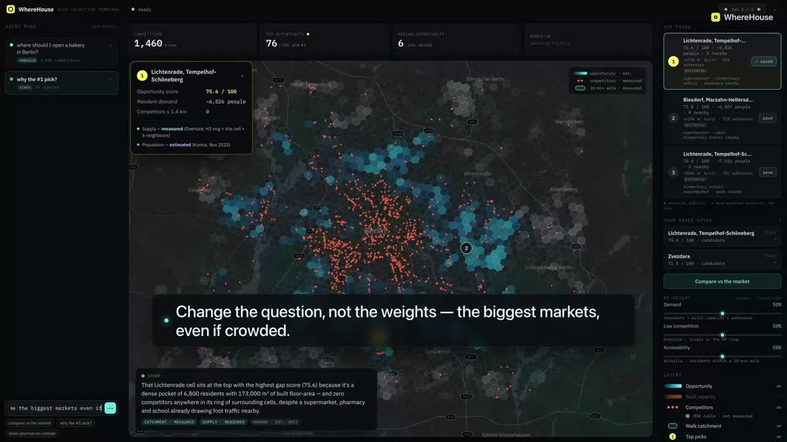
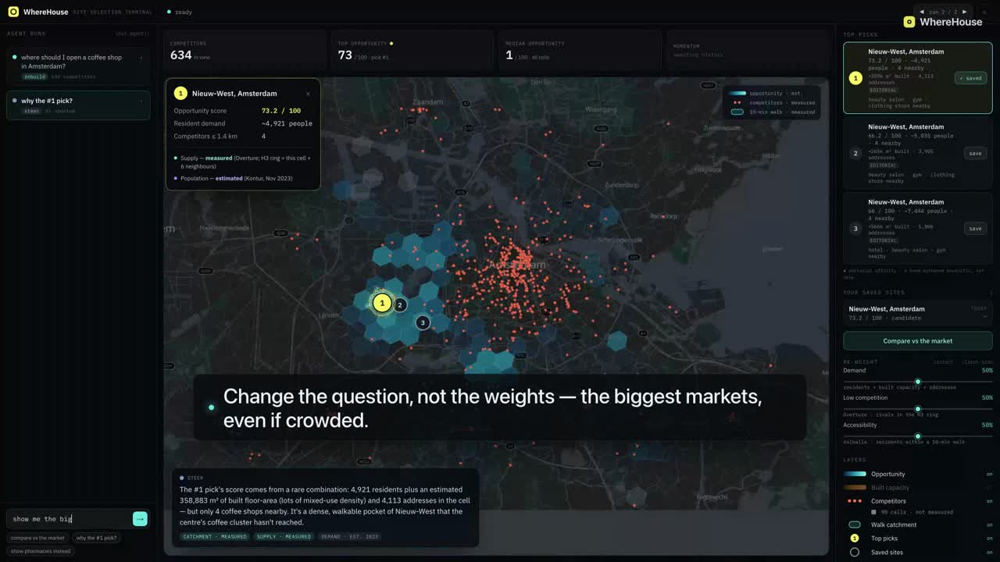
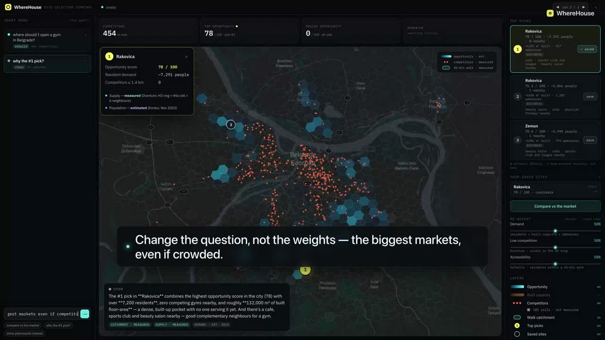

# WhereHouse

**Ask where to open your business. Get a map, not an essay.**

WhereHouse is a geospatial chat agent for site selection. You ask, in plain words,
*"Where should I open a bakery in Berlin?"* — and the answer **assembles itself on a live
map**: the competition drops in as dots, a demand-vs-supply opportunity surface fades in,
the three best sites pin themselves, a real 10-minute walking catchment blooms around the
winner, and a momentum sparkline says whether the market is rising or saturating. The agent
writes at most two sentences. Everything else is drawn.

Built for the **ClickHouse × Trigger.dev Virtual Summer Hackathon 2026** — theme
*"Beyond the Wall of Text"*, judged on the ratio of insight to words.

> **Live demo:** https://app.slim-shaggy.com — and the app is served *out of ClickHouse
> itself* (see [ADR-003](docs/architecture/clickhouse-as-webserver.md)).

Demo cities: **Berlin · Amsterdam · Belgrade**.

---

## Watch it work

Every frame is the **real deployed app** at [app.slim-shaggy.com](https://app.slim-shaggy.com)
assembling a live answer — no mockups, no stock footage. One question per city, then the follow-ups
that make it a *consultant, not a calculator*: ask for the biggest markets, rule out the saturated
turf, or zoom into one neighbourhood, and the pins **re-rank themselves**. **Click a still to watch
on YouTube** (~2 min each):

### Berlin — where to open a bakery

[](https://youtu.be/HQ6T2WPsu3o)

### Amsterdam — where to open a coffee shop

[](https://youtu.be/jv_b7LEWCyk)

### Belgrade — where to open a gym

[](https://youtu.be/b-Ey7hIeZvQ)

> Prefer the raw files? All three are attached to the
> [demo release](https://github.com/andrewkomkov/wherehouse/releases/tag/demo-2026-07-21).

---

## Why this fits the theme

"Where should I open this?" is an inherently spatial question. Answering it with a paragraph
is the exact failure *"Beyond the Wall of Text"* is about. So the product has a hard rule,
enforced in the agent's own prompt: **the map is the answer; prose is a defect.** The model
never sees the geometry — it gets row counts and small summaries — so it *cannot* recite the
data back at you even if it wanted to. Its two-sentence caption is only allowed to say what
the map cannot show: the pattern behind the answer.

---

## What each sponsor technology does — and how deeply

### ClickHouse is the primary database, the geospatial engine, **and the web server**

Not a cache, not a sidecar. Every layer on the map is a GeoJSON string **assembled in SQL**
and streamed straight to the browser.

- **75M+ Overture Maps POIs, queried in place from public S3** with `s3()` — no ingestion
  pipeline. 211,818 POIs for the three cities are materialised into `geo.places` with H3
  indexes computed in `MATERIALIZED` columns. ([ADR-002](docs/architecture/data-sources.md))
- **H3 hexagonal scoring.** Demand (475,535 Kontur population cells) joins supply (POIs in an
  `h3kRing`) and accessibility (Valhalla isochrones snapped to H3) on **cell-id equality — no
  interpolation.** The GAP score is one explainable SQL formula, derived per city and category
  at query time (p95-normalised, no magic constants).
- **The app is served from a `MergeTree` row.** The static bundle lives in `web.assets`; a
  thin Cloudflare Worker streams it and the browser then queries ClickHouse directly (CORS is
  open) for the map's data. GeoJSON is built by hand with `toJSONString`/`arrayStringConcat`
  because Cloud 26.4 predates the native `GeoJSON` format.
  ([ADR-003](docs/architecture/clickhouse-as-webserver.md))
- **Real ClickHouse feature depth, where it earns its place:** a `Dictionary` +
  `dictGetFloat32` UDF for complementary-business affinity; an incremental
  `AggregatingMergeTree` **materialized view** (`category_momentum`) rolling OSM edit-history
  into per-cell monthly momentum; `ReplacingMergeTree` + `FINAL` for the saved-site store.
- **Your own state, joined against the world:** a site you saved seconds ago is re-scored
  against today's 75M-POI market on H3 equality. It lived in a ClickHouse-managed Postgres
  replicated back by **ClickPipes CDC** for the hackathon's OLTP+OLAP prize
  ([ADR-004](docs/architecture/oltp-olap.md)); it now lives in ClickHouse itself, and the join
  is unchanged ([ADR-005](docs/architecture/saved-sites-in-clickhouse.md)).

### Trigger.dev `chat.agent()` orchestrates the whole answer

- The agent exposes **14 tools**. Eight build the answer (`findCompetitors`, `scoreArea`,
  `showBuiltCapacity`, `rankSites`, `showCatchment`, `categoryTrend`, `saveSite`,
  `compareSavedSites`); six let the agent **operate the UI itself** (toggle layers, move the
  re-weight sliders, focus a pick, highlight the best/worst cell, rewind to a past run, export
  a PDF).
- **`rankSites` is a consultant, not a fixed top-3.** Beyond the balanced best three it ranks
  under a strategy lens (biggest market / least competition / best foot traffic), shows where
  *not* to open (the most saturated cells), ranks inside a named district, and pages up to six
  pins — all over the same scored cells, with the balanced default unchanged.
- **The progressive map is the innovation.** Each tool emits a `data-map` part with a *stable
  id*; re-writing that id **updates the part in place** instead of appending. That is what
  makes the map fill in wave by wave while the agent is still working, instead of appearing all
  at once at the end. ([ADR-001](docs/architecture/progressive-map.md))
- **A hard ~1 MiB per-record stream cap is designed around, not hit.** An over-budget layer
  (e.g. all 6,664 food-and-drink points) never touches the stream: it lands in a `web.layers`
  row and the part carries a handle, which the browser resolves directly from ClickHouse.
- Deployed to Trigger.dev's managed prod environment, so the live site works with **no local
  process running** ([`infra/deploy-trigger.sh`](infra/deploy-trigger.sh)).

---

## The answer flow

```
                       Trigger.dev  chat.agent()
  you ask ──▶  ┌──────────────────────────────────────────┐
               │ findCompetitors → scoreArea → rankSites   │
               │   → showCatchment → categoryTrend         │
               └───────────────┬──────────────────────────┘
                               │  (model sees only row counts + summaries)
             data-map / data-trend parts, stable ids, updated in place
                               │
                               ▼
   ClickHouse Cloud  ◀── GeoJSON built in SQL ──▶  MapLibre  (the answer assembles)
     • geo.places        (Overture POIs, H3)
     • geo.population     (Kontur demand)
     • geo.isochrones     (Valhalla walk catchments, precomputed)
     • geo.districts      (Overture divisions → real place names)
     • geo.affinity       (Dictionary UDF)
     • geo.category_momentum (incremental MV)
     • app.saved_sites    (your saved sites — the same DB, joined on H3)
```

The first screen is a Claude/ChatGPT-style **omnibar**; on your first question it transitions
into the map dashboard, where the layers draw themselves.

---

## Data & attribution

| Layer | Source | Volume |
|---|---|---|
| Places, districts | [Overture Maps](https://overturemaps.org) via public S3 — Places CDLA Permissive 2.0, Divisions ODbL | 211,818 POIs · 4,075 district shapes |
| Population (demand) | [Kontur](https://data.humdata.org/dataset/kontur-population-dataset) (CC BY 4.0) | 475,535 H3 res-8 cells |
| Walk catchments | [Valhalla](https://github.com/valhalla/valhalla) on OSM (ODbL), precomputed | 63,479 isochrones · 20,724 origins |
| Momentum | [ohsome](https://api.ohsome.org)/OSM edit history (ODbL) | monthly series → incremental MV |
| Basemap | [Protomaps](https://protomaps.com) PMTiles / [OpenStreetMap](https://openstreetmap.org) | 3 cities < 100 MB |

Every number the agent utters is one a tool returned; place names come from real
point-in-polygon against Overture divisions, never invented. Editorial signals (the affinity
weights) are labelled as editorial in every code path and in the UI — never presented as
measurement.

---

## Run it locally

```sh
cp .env.example .env          # fill in ClickHouse + Trigger.dev credentials
./infra/check-env.sh          # verifies every credential against the live services (~5s)

cd web
pnpm install
pnpm dev                      # the app on http://localhost:3000
pnpm exec trigger dev         # the chat.agent() task, in a second terminal
```

Provision the cloud from nothing (idempotent, all via the Cloud REST API):

```sh
./infra/provision.sh          # ClickHouse service + the app schema
./infra/deploy-app.sh         # build the static bundle → load into ClickHouse → deploy the Worker
./infra/deploy-trigger.sh     # ship the agent to Trigger.dev prod and wire the Worker to it
```

---

## Repository map

| Path | What |
|---|---|
| [`web/`](web) | Next.js app (static export). `src/trigger/` = the agent + SQL; `src/components/chat.tsx` = the whole UI |
| [`infra/`](infra) | Everything provisioned as code — ClickHouse, basemap, Valhalla, deploys |
| [`db/`](db) | ClickHouse schemas and loaders |
| [`video/`](video) | The demo video pipeline — scenario, voiceover script, Remotion + Playwright |
| [`docs/PLAN.md`](docs/PLAN.md) | Day-by-day plan, what's cut, risk register |
| [`docs/architecture/`](docs/architecture) | ADR-001…005 — read before changing direction |
| [`.specify/memory/constitution.md`](.specify/memory/constitution.md) | Project constitution — verify against the live system, prove the riskiest path first |

---

## Innovation, in one line each

- **The map is the response** — layers stream in place through `chat.agent()`, wave by wave.
- **ClickHouse is the web server** — the app is a database row; the browser talks to the DB.
- **Your state × the world in one join** — a site saved seconds ago, scored against 75M POIs.
- **Honesty as a feature** — absent data is shown as absent; unmeasured cells are labelled, not
  zero-filled; the agent is structurally unable to invent a place name.

## Licence

MIT — see [LICENSE](LICENSE). Map data © [OpenStreetMap](https://openstreetmap.org)
contributors via [Overture Maps](https://overturemaps.org) and [Protomaps](https://protomaps.com);
population © [Kontur](https://data.humdata.org/dataset/kontur-population-dataset) (CC BY 4.0).
